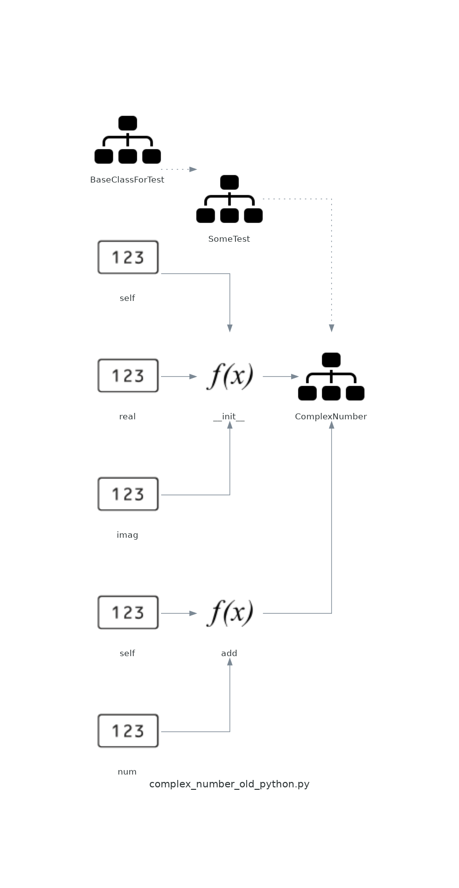
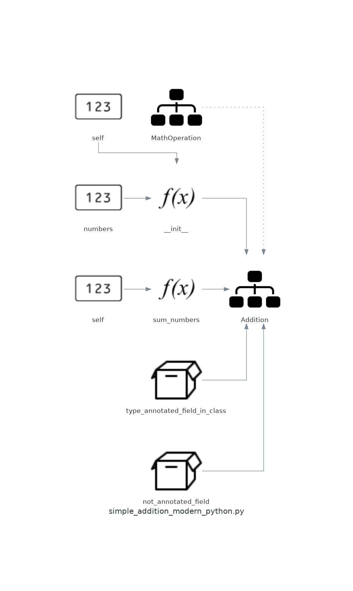

# Specifipy
### Python package for auto-generating code diagrams


## What is that? 
Specifipy helps you *visually* understand code. It generates **UML code diagrams** 
for your object-oriented programs showing you the inheritance, interfaces, fields, methods and
functions. Assuming you need to provide a very detailed documentation of your OO software, see if the
things make sense or not, you're going through some kind of audit - it might prove useful.

## How to use that? 
### Scanning directory and generating diagrams for all files
Import the `specifipy` class you need. If you want to recursively scan the directory (probably 
the most common usecase) just follow these steps:
```python
from specifipy.file_scanners.directory_scanner import DirectoryScanner
d = DirectoryScanner("/path/to/your/src/directory")
d.make_diagrams()
```

This will create all the diagrams for all the files that contain Python classes right in your working dir. You can, of
course, provide the directory in `make_diagrams` to have the output file wherever you wish.

### Using Java?
In such case, you'll need to provide additional arguments, like this:
```python
from specifipy.file_scanners.directory_scanner import DirectoryScanner
from specifipy.parsers.generic_parser import FileType
d = DirectoryScanner("/path/to/your/src/directory", FileType.JAVA)
d.make_diagrams()
```

### In-place diagram generation
If you want to generate diagram in-place, for a single file, you can just load its context into a string and
then provide it directly to the `DiagramGenerator`, like this:
```python
from specifipy.parsers.diagram_generator_d2 import DiagramGenerator

diagram_generator = DiagramGenerator()
diagram_generator.generate_diagram(
    file_contents_str,
    "complex_number_old_python.py",
    base_path=f"./diagrams/",
)
```

Of course, you can provide as `file_contents_str` any valid code however you'd like, not only from a file.

### Using TypeScript?
Pass `FileType.TYPESCRIPT` — specifipy uses tree-sitter under the hood so no extra compiler is needed:
```python
from specifipy.file_scanners.directory_scanner import DirectoryScanner
from specifipy.parsers.generic_parser import FileType
d = DirectoryScanner("/path/to/your/src/directory", FileType.TYPESCRIPT)
d.make_diagrams()
```

TypeScript support requires the optional dependencies `tree-sitter` and `tree-sitter-typescript`:
```
pip install tree-sitter tree-sitter-typescript
```

### Generating Mermaid diagrams
By default specifipy produces D2 (`.d2`) files. To get Mermaid (`.mmd`) instead — which renders
natively on GitHub, GitLab, Obsidian and many other platforms — use the `DiagramGeneratorFactory`:
```python
from specifipy.file_scanners.directory_scanner import DirectoryScanner
from specifipy.parsers.diagram_generator_factory import DiagramFormat, DiagramGeneratorFactory
from specifipy.parsers.generic_parser import FileType

generator = DiagramGeneratorFactory.get_generator(
    diagram_format=DiagramFormat.MERMAID,
    file_type=FileType.PYTHON,
)
scanner = DirectoryScanner("/path/to/src")
scanner.make_diagrams(generator=generator, base_path="./docs/")
```

The output follows the standard Mermaid `classDiagram` syntax:
```
classDiagram
    class Addition {
        +int type_annotated_field_in_class
        +__init__(self, numbers) list[int]
        +sum_numbers(self) int
    }
    Addition --|> MathOperation
```

### Association relationships
In addition to inheritance and interface-implementation arrows, specifipy now detects
**associations** — when a class holds a typed field whose type is another known class in the same
codebase. These are drawn as dashed arrows in D2 and `-->` arrows in Mermaid:

```python
class Engine:
    horsepower: int

class Car:
    engine: Engine   # <-- association detected, Car --> Engine arrow is emitted
```

Generic container wrappers are unwrapped automatically, so `orders: list[Order]` still produces a
`Customer --> Order` relationship.

### Filtering output
Pass a `FilterOptions` object to any generator to control what appears in the diagram:

```python
from specifipy.parsers.diagram_generator_factory import DiagramFormat, DiagramGeneratorFactory
from specifipy.parsers.result_filter import FilterOptions

generator = DiagramGeneratorFactory.get_generator(
    diagram_format=DiagramFormat.D2,
    filter_options=FilterOptions(
        public_only=True,               # hide private/dunder methods and fields
        include_classes=["Order", "Customer"],  # only diagram these classes
    ),
)
```

`public_only=True` strips Python `_private` / `__dunder__` members and Java `private` members
(the `-` prefix convention).

### Available parsers
Currently, there are three parsers available — Python, Java, and TypeScript:


### Diagram example
The complete diagram for the below code:
```python
class BaseClassForTest:
    pass


class SomeTest(BaseClassForTest):
    pass


class ComplexNumber(SomeTest):
    """
    This is a class for mathematical operations on complex numbers.

    Attributes:
        real (int): The real part of complex number.
        imag (int): The imaginary part of complex number.
    """

    def __init__(self, real, imag):
        """
        The constructor for ComplexNumber class.

        Parameters:
           @:param real (int): The real part of complex number.
           @:param imag (int): The imaginary part of complex number.
        """
        self.real = real

    def add(self, num):
        """
        The function to add two Complex Numbers.

        Parameters:
            num (ComplexNumber): The complex number to be added.

        Returns:
            ComplexNumber: A complex number which contains the sum.
        """

        re = self.real + num.real
        im = self.imag + num.imag

        return ComplexNumber(re, im)

```
...looks something like this:


or for the code:
```python
class MathOperation:
    pass


class Addition(MathOperation):

    type_annotated_field_in_class: int
    not_annotated_field = 0


    def __init__(self, numbers: list[int]):
        self.numbers = numbers

    def sum_numbers(self) -> int:
        running_sum: int = 0
        for number in self.numbers:
            running_sum += number

        return running_sum

```
it'll be something closer to this:



And here's this exact codebase (including examples above):


---
So, in reality you get a d2 file (or a set of d2 files, depending on the `collect_files` parameter). 
Your actual output follows the d2 specification:
```d2
direction: up
BaseClassForTest: {
  shape: class
}
SomeTest: {
  shape: class
}
ComplexNumber: {
  __init__(self, real, imag): 'None'
  add(self, num): 'None'
  shape: class
}
SomeTest -> BaseClassForTest
ComplexNumber -> SomeTest
```

If you're generating Java code, the dotted line is used to indicate implemented interface instead of class inheritance,
and private fields and methods are marked accordingly.

### Using the CLI
After installation, a `specifipy` command is available:

```
specifipy <path> [options]
```

| Option | Default | Description |
|---|---|---|
| `--format d2\|mermaid` | `d2` | Output diagram format |
| `--file-type python\|java\|typescript` | `python` | Source language |
| `--output <dir>` | current dir | Where to write diagram files |
| `--public-only` | off | Hide private/dunder members |
| `--exclude-pattern <glob>` | — | Skip files matching this pattern (e.g. `test_*.py`) |
| `--include-classes A B …` | all | Only diagram these class names |
| `--no-collect` | off | Write one file per source file instead of a combined diagram |

Examples:

```bash
# Generate a single Mermaid diagram for a Python project, skipping test files
specifipy ./src --format mermaid --output ./docs --exclude-pattern "test_*.py"

# Generate D2 diagrams for a Java project, public API only
specifipy ./src --file-type java --public-only --output ./diagrams

# Only diagram two specific classes from a TypeScript project
specifipy ./src --file-type typescript --include-classes UserService AuthService
```

---
If you like this project, and it helped you in any way, I'll be thrilled to know that! I like to write software that's
actually useful.
