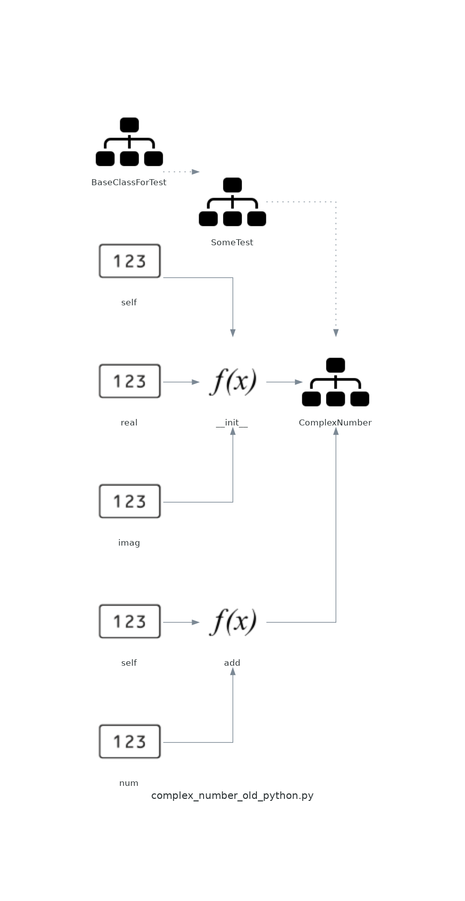
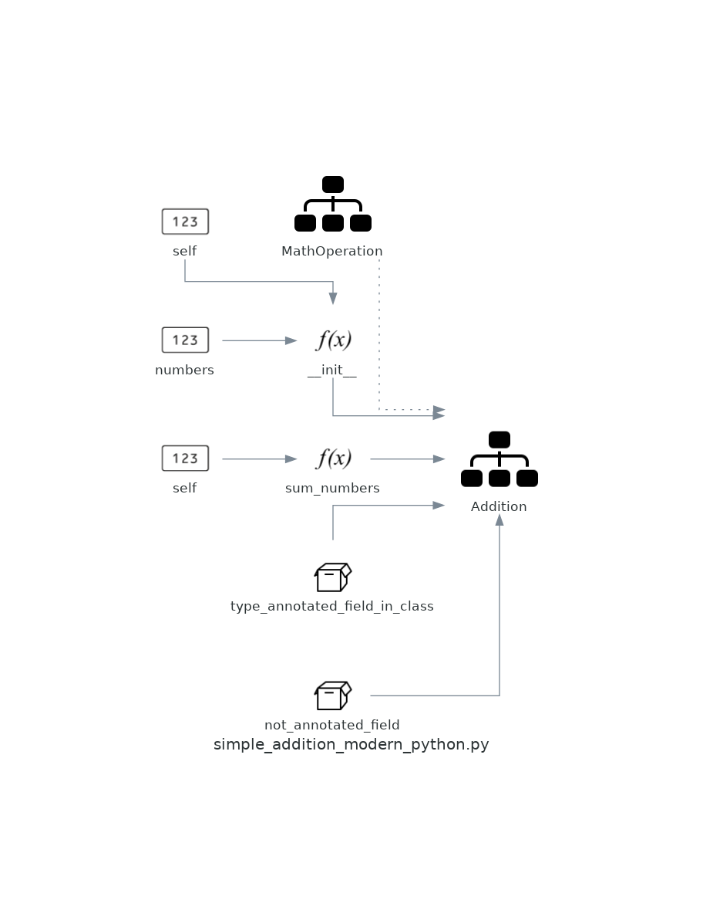

# Specifipy
Python package for auto-generating code diagrams

## What is that? 
Specifipy helps you visually understand your Python classes. It generates code diagrams 
for your object-oriented Python programs showing you the inheritance, fields, methods and
functions.

## Core elements
### Classes
Represents Python class\


### Fields
Represents class fields\


### Functions
Represents functions\


### Params
Represents functions' parameters\


### Diagram example
The complete diagram looks something like this\
```python
class BaseClassForTest:
    pass


class SomeTest(BaseClassForTest):
    pass


class ComplexNumber(SomeTest):
    """
    This is a class for mathematical operations on complex numbers.

    Attributes:
        real (int): The real part of complex number.
        imag (int): The imaginary part of complex number.
    """

    def __init__(self, real, imag):
        """
        The constructor for ComplexNumber class.

        Parameters:
           @:param real (int): The real part of complex number.
           @:param imag (int): The imaginary part of complex number.
        """
        self.real = real

    def add(self, num):
        """
        The function to add two Complex Numbers.

        Parameters:
            num (ComplexNumber): The complex number to be added.

        Returns:
            ComplexNumber: A complex number which contains the sum.
        """

        re = self.real + num.real
        im = self.imag + num.imag

        return ComplexNumber(re, im)

```


or like this
```python
class MathOperation:
    pass


class Addition(MathOperation):

    type_annotated_field_in_class: int
    not_annotated_field = 0


    def __init__(self, numbers: list[int]):
        self.numbers = numbers

    def sum_numbers(self) -> int:
        running_sum: int = 0
        for number in self.numbers:
            running_sum += number

        return running_sum

```

